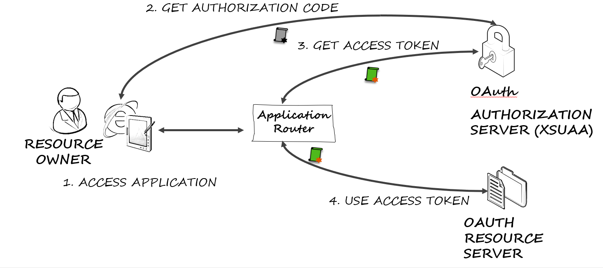

# Description
Authentication services provided by the xsuaa service on [SAP Cloud Platform](https://cloudplatform.sap.com) or [SAP HANA XS Advanced](https://help.sap.com/viewer/4505d0bdaf4948449b7f7379d24d0f0d/2.0.00/en-US) rely on usage of the [OAuth 2.0](https://oauth.net) protocol and OAuth 2.0 access tokens.
## Web Flow for Authentication
Typical UI5 applications consist of a server providing the HTML content and one or more application serving REST APIs used by the application. Web application use the OAuth Authorization Code Flow for interactive authentication:
1. A user accesses the web application using a browser or mobile device
2. The web application (in typical SAP Cloud Platform applications, this is an approuter) acts as OAuth client and redirects to the OAuth server for authorization
3. Upon authentication, the web application uses the code issued by the authorization server to request an access token
4. The web application uses the access token to request data from the OAuth resource server. The OAuth resource server validates the token using online or offline validation.



OAuth resource servers (as the one in step 4) require libraries for validating access tokens.

## Token Validation for Java web applications using SAP Java Buildpack
The SAP Java Buildpack integrates token validation into the tomcat server. Application developers requiring authentication and authorization information in their application use the interfaces defined in [api](./api) to obtain like user name and scopes.
### Requirements
- Java 8
- maven 3.3.9 or later
- The application is deployed using the SAP Java Buildpack
### Sample
See [sap-java-builpack-api-uage](samples/sap-java-buildpack-api-usage) for an example.

## Token Validation for Java Spring Boot web applications
Spring Boot provides OAuth resource servers. Application developers requiring authentication and authorization information in their application use the libraries defined in [spring-xsuaa](./spring-xsuaa) to obtain like user name and scopes.
### Requirements
- Java 8
- maven 3.3.9 or later
- Spring Boot 2.1 and later
### Sample
See [spring-security-xsuaa-usage](samples/spring-security-xsuaa-usage) for an example.


# Download and Installation
To download and install the this project clone this repository via:
```
git clone https://github.com/SAP/cloud-security-xsuaa-integration
cd cloud-security-xsuaa-integration
mvn package
```
*Note:* Use this is you want to enahnce this xsuaa integration libraries. The buid results are also available on maven central. 

# Limitations
Libraries and information provided here is around the topic of integrating with the xsuaa service. General integration into other OAuth authorization servers is not the primary focus.

# How to obtain support
Open an issue in GitHub
# To-Do (upcoming changes)
The initial version will contain the api used by SAP Java Buildpack. Upcoming version will also provide integration into the Spring framework.

# License
Copyright (c) 2018 SAP SE or an SAP affiliate company. All rights reserved.
This file is licensed under the Apache Software License, v. 2 except as noted otherwise in the LICENSE file [LICENSE.md].
