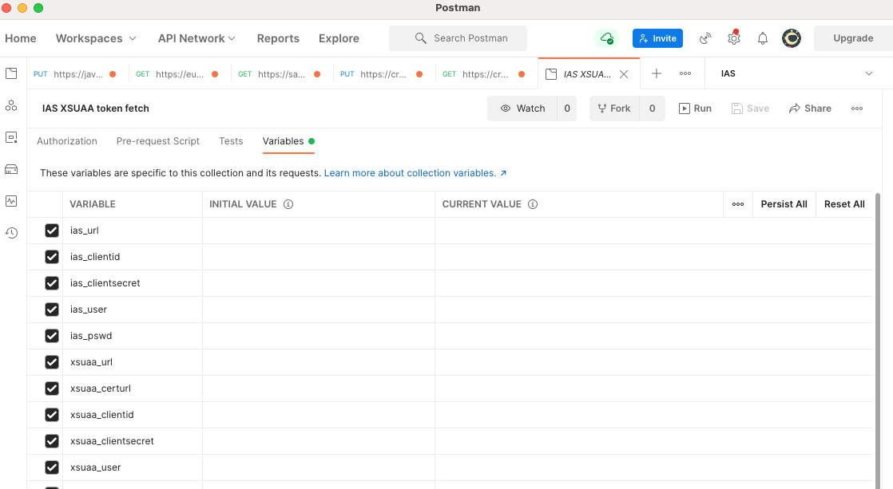

# How to fetch tokens
Get your service configuration:
- In CF from [VCAP_SERVICES](https://docs.cloudfoundry.org/devguide/deploy-apps/environment-variable.html#VCAP-SERVICES) environment variable
- In K8s/Kyma from configuration [secrets](https://kubernetes.io/docs/concepts/configuration/secret/)

The documentation assumes the utility `curl` and `awk` to be installed (Mac OS: brew install curl, Ubuntu: sudo apt-get install curl). Alternatively, use [Postman Rest Client](https://www.postman.com/downloads/).

## IAS Tokens
<details>
  <summary>Using <b>X.509</b> Client Certificate</summary>
  
1. Store the `certificate` and `key` from your service configuration in separate files in [PEM](https://www.ssl.com/guide/pem-der-crt-and-cer-x-509-encodings-and-conversions/#ftoc-heading-1) format.
   >❗ In case you experience invalid PEM file errors, \\n characters might have to be replaced by newlines \n to have the PEM in the correct format.
   > ```shell script    
   > awk '{gsub(/\\n/,"\n")}1' <file>.pem
   >  ```
 
2. Fetch the token using:

    <details>
      <summary>curl command</summary>
        
    ❗Replace the `<<>>` placeholders with the values from the service configuration.
    ```shell script
    curl --cert certificate.pem --key key.pem -XPOST <<credentials.url>>/oauth2/token \
      -d 'grant_type=password&client_id=<<credentials.clientid>>&username=<<your ias user>>&password=<<your ias password>>'
    ```
    </details>
    <details>
       <summary>Postman</summary>
            
    1. In Postman navigate to Settings -> Certificates, click on "Add Certificate" and provide the certificate and key `PEM` files and host name.
       <br>
    2. Import [Postman Collection](./IAS_XSUAA_token_fetch.postman_collection.json). For more info on how to import it in the Postman see [learning.postman.com](https://learning.postman.com/docs/getting-started/importing-and-exporting-data/#importing-postman-data)
    3. Fill in the corresponding ias_* Postman variables
       <br>
    4. Open the 'IAS Token | pswd grant' Postman Collection and send the request
    </details>
</details> 
<details>
  <summary>Using <b>Client Credentials</b></summary>

1. Fetch the token using:
    <details>
        <summary>curl command</summary>
        
    ❗Replace the `<<>>` placeholders with the values from the service configuration.
    ```shell script   
    curl -XPOST -u '<<credentials.clientid>>:<<credentials.clientsecret>>' https://<<credentials.url>>/oauth2/token \
         -d 'grant_type=password&username=<<your ias user>>&password=<<your ias password>>'
    ```
    </details>
    <details>
        <summary>Postman</summary>
        
    1. Import [Postman Collection](./IAS_XSUAA_token_fetch.postman_collection.json). For more info how to import it in Postman see [learning.postman.com](https://learning.postman.com/docs/getting-started/importing-and-exporting-data/#importing-postman-data)
    2. Fill in the corresponding ias_* Postman variables
       <br>
    3. Open the 'Ias Token | pswd grant' Postman Collection and send the request
    </details>
</details>
  
## XSUAA Tokens
<details>
   <summary>Using X.509 Client Certificate</summary>

1. Store the `certificate` and `key` from your service configuration in separate files in [PEM](https://www.ssl.com/guide/pem-der-crt-and-cer-x-509-encodings-and-conversions/#ftoc-heading-1) format.
   > ❗ In case you experience invalid PEM file errors, \\n characters might have to be replaced by newlines \n to have the PEM in the correct format.
   > ```shell script
   > awk '{gsub(/\\n/,"\n")}1' <file>.pem
   > ```
2. Fetch the token using:
   <details>
      <summary>curl command</summary>
        
      ❗Replace the `<<>>` placeholders with the values from the service configuration.
      ```shell
      curl --cert certificate.pem --key key.pem \
      -X POST <<credentials.certurl>>/oauth/token \
      -H 'Content-Type: application/x-www-form-urlencoded' \
      --data-urlencode 'client_id=<<credentials.clientid>>' \
      --data-urlencode 'grant_type=password' \
      --data-urlencode 'username=<<username in xsuaa tenant>>' \
      --data-urlencode 'password=<<xsuaa password>>'
      ```
    </details>
    <details>
        <summary>Postman</summary>
    
    1. In Postman navigate to Settings -> Certificates, click on "Add Certificate" and provide the certificate and key `PEM` files and host name.
       <br>
    2. Import [Postman Collection](./IAS_XSUAA_token_fetch.postman_collection.json). For more info on how to import it in the Postman see [learning.postman.com](https://learning.postman.com/docs/getting-started/importing-and-exporting-data/#importing-postman-data)
    3. Fill in the corresponding xsuaa_* Postman variables
       <br>
    4. Open the 'Xsuaa Token | pswd grant mTLS' Postman Collection and send the request
    </details>
</details>
<details>
   <summary>Using <b>Client Credentials</b></summary>
   
1. Fetch the token using:    
   <details>
     <summary>curl command</summary>
             
   ❗Replace the `<<>>` placeholders with the values from the service configuration.
   ```shell
   curl \
   -X POST <<credentials.url>>/oauth/token \
   -H 'Content-Type: application/x-www-form-urlencoded' \
   --data-urlencode 'client_id=<<credentials.clientid>>' \
   --data-urlencode 'client_secret=<<credentials.clientsecret>>' \
   --data-urlencode 'grant_type=password' \
   --data-urlencode 'username=<<username in xsuaa tenant>>' \
   --data-urlencode 'password=<<xsuaa password>>'
   ```
   </details>
   <details>
       <summary>Postman</summary>
       
   1. Import [Postman Collection](./IAS_XSUAA_token_fetch.postman_collection.json). For more info how to import it in Postman see [learning.postman.com](https://learning.postman.com/docs/getting-started/importing-and-exporting-data/#importing-postman-data)
   2. Fill in the corresponding xsuaa_* Postman variables
      <br>
   3. Open the 'Xsuaa Token | pswd grant' Postman Collection and send the request
   </details>
</details>
