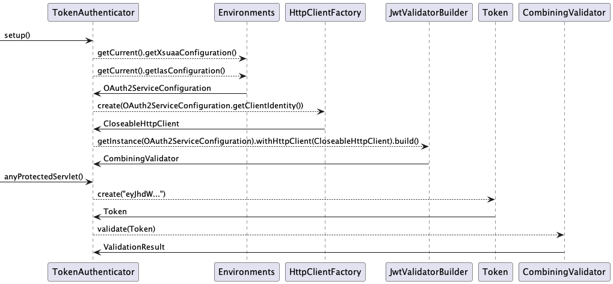
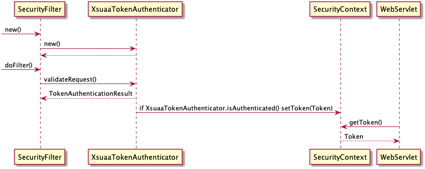

# SAP BTP Java Security Client Library

This library provides a Token Validation utility for Jakarta EE applications. Tokens issued by SAP BTP Identity service and Xsuaa services are supported. Moreover, Identity tokens issued by multiple tenants can also be validated.

To be able to validate tokens it performs the following tasks:
- Loads Identity Service Configuration from `VCAP_SERVICES` in Cloud Foundry or from secrets in Kubernetes environment into the [`OAuth2ServiceConfiguration`](/java-api/src/main/java/com/sap/cloud/security/config/OAuth2ServiceConfiguration.java). The [`Environments`](/env/src/main/java/com/sap/cloud/security/config/Environments.java) serves as central entry point to get access to the `OAuth2ServiceConfiguration`.
- Decodes and parses encoded JSON Web Tokens into [`Token`](/java-api/src/main/java/com/sap/cloud/security/token/Token.java) object which provides convenient getter methods to access token header parameters and claims. `Token` is a Java implementation of JSON Web Token (JWT) - [RFC 7519](https://tools.ietf.org/html/rfc7519). 
- Validates the decoded token. 
  - The [`JwtValidatorBuilder`](src/main/java/com/sap/cloud/security/token/validation/validators/JwtValidatorBuilder.java) gathers all required Jwt validators for specified security service - `Xsuaa` or `Identity`.
  - The [`TokenAuthenticator`](/java-api/src/main/java/com/sap/cloud/security/servlet/TokenAuthenticator.java) interface serves as a validation entry point for tokens contained in the authorization header of HTTP requests and has 2 implementations provided:
    [IasAuthenticator](src/main/java/com/sap/cloud/security/servlet/IasTokenAuthenticator.java) and [XsuaaAuthenticator](src/main/java/com/sap/cloud/security/servlet/XsuaaTokenAuthenticator.java). These implementations initialize the `JwtValidatorBuilder` for the corresponding security service which returns `CombiningValidator` and then the Token validations is delegated to the Jwt Validators from the `CombiningValidator`:
      - [`JwtTimestampValidator`](
        src/main/java/com/sap/cloud/security/token/validation/validators/JwtTimestampValidator.java) - checks if the JWT is used before the `exp` (expiration) time and if it is used after the `nbf` (not before) time
      - [`JwtIssuerValidator`](src/main/java/com/sap/cloud/security/token/validation/validators/JwtIssuerValidator.java)(Identity service only) - validates if the JWT is issued by a trustworthy identity service
      - [`XsuaaJkuValidator`](
        src/main/java/com/sap/cloud/security/token/validation/validators/XsuaaJkuValidator.java)(Xsuaa only) - validates if the JWT provides a valid `jku` token header parameter that points to a JWKS url from a trustworthy identity service. This `jku` needs to match the `uaadomain` from service configuration.
      - [`JwtAudienceValidator`](
        src/main/java/com/sap/cloud/security/token/validation/validators/JwtAudienceValidator.java) - checks if the JWT is intended for the OAuth2 client of this application. The `aud` (audience) claim identifies the recipients the JWT is issued for.
      - [`JwtSignatureValidator`](
        src/main/java/com/sap/cloud/security/token/validation/validators/JwtSignatureValidator.java) -  checks if the JWT is signed with the public key of a trustworthy identity service. With that it also makes sure that the payload and the header of the JWT is unchanged.
- Stores the decoded and validated token in thread-local cache [`SecurityContext`](/java-api/src/main/java/com/sap/cloud/security/token/SecurityContext.java).

:bulb: This library is also integrated in the [SAP Java Buildpack](https://help.sap.com/docs/btp/sap-business-technology-platform/developing-java-in-cloud-foundry-environment), but as of now SAP Java Buildpack does **not** support Tomcat 10 runtime, which is required for the Jakarta API used by this library.



#### Supported Environments
- Cloud Foundry
- Kubernetes/Kyma

#### Supported Identity Services
- SAP Identity service, supports Multitenancy/multiple zones
- XSUAA

#### Supported Token Signature Algorithms
| JWS    | Algorithm   | Description                     |
|--------|-------------|---------------------------------|
| RS256  | RSA256      | RSASSA-PKCS1-v1_5 with SHA-256  |

## Requirements
- Java 17
- [Apache HttpClient 4.5](https://hc.apache.org/httpcomponents-client-4.5.x/index.html)
- Tomcat 10 or any other servlet that implements specification of the Jakarta EE platform

## Table of Contents
1. [Setup](#setup)
    - [Maven Dependencies](#maven-dependencies)
2. [Usage](#usage)
    - [TokenAuthenticator Usage](#tokenauthenticator-usage)
    - [OAuth2ServiceServiceConfiguration Usage](#oauth2serviceserviceconfiguration-usage)
    - [JwtValidatorBuilder usage](#jwtvalidatorbuilder-usage)
    - [Token keys(JWKs) cache](#token-keys--jwks--cache)
    - [Validation listener usage](#validationlistener-usage)
    - [ProofOfPossession validation](#proofofpossession-validation)
3. [Test Utilities](#test-utilities)
    + [Local testing](#local-testing)
4. [Troubleshooting](#troubleshooting)
   - [Set debug log level](#set-debug-log-level)
   - [Get buildpack version](#get-buildpack-version)
   - [Common Pitfalls](#common-pitfalls)
5. [Specification und References](#specification-und-references)
6. [Samples](#samples)

## Setup
### Maven Dependencies
```xml
<dependency>
    <groupId>com.sap.cloud.security</groupId>
    <artifactId>java-security</artifactId>
    <version>3.1.0</version>
</dependency>
<dependency>
    <groupId>org.apache.httpcomponents.client5</groupId>
    <artifactId>httpclient5</artifactId>
</dependency>
```

## Usage
### `TokenAuthenticator` usage
The [`TokenAuthenticator`](/java-api/src/main/java/com/sap/cloud/security/servlet/TokenAuthenticator.java)  makes it easy to integrate token based authentication into your java application.
The library provides 2 default implementations of `TokenAuthenticator` interface:
- [XsuaaTokenAuthenticator](src/main/java/com/sap/cloud/security/servlet/XsuaaTokenAuthenticator.java) for Xsuaa Access token validation
- [IasTokenAuthenticator](src/main/java/com/sap/cloud/security/servlet/IasTokenAuthenticator.java) for Identity OIDC token validation.

`XsuaaTokenAuthenticator` and `IasTokenAuthenticator` takes care of
* `OAuth2ServiceConfiguration` loading
* `org.apache.http.HttpClient` initialization (it's required for signature validation)
* Jwt Validator setup with help of [`JwtValidatorBuilder`](src/main/java/com/sap/cloud/security/token/validation/validators/JwtValidatorBuilder.java)

Once `TokenAuthenticator#validateRequest(ServletRequest, ServletResponse)` is called, it'll extract the token from the incoming `ServletRequest` and delegate it to the default Jwt validators for corresponding security service.


>:bulb: In case the default authenticators does not fit to your needs it is possible to customize them



The previously mentioned authenticators can be directly initialized in the `jakarta.servlet.Filter` implementation as follows 
```java
import com.sap.cloud.security.servlet.TokenAuthenticationResult;
import com.sap.cloud.security.servlet.XsuaaTokenAuthenticator;
import com.sap.cloud.security.token.SecurityContext;
import jakarta.servlet.Filter;
import jakarta.servlet.FilterChain;
import jakarta.servlet.ServletRequest;
import jakarta.servlet.ServletResponse;
import jakarta.servlet.annotation.WebFilter;

@WebFilter("/*") 
public class XsuaaSecurityFilter implements Filter {

	private final XsuaaTokenAuthenticator xsuaaTokenAuthenticator;

	public XsuaaSecurityFilter() {
		xsuaaTokenAuthenticator = new XsuaaTokenAuthenticator();
	}

	@Override
	public void doFilter(ServletRequest request, ServletResponse response, FilterChain chain)
			throws IOException, ServletException {
		try {
			TokenAuthenticationResult authenticationResult = xsuaaTokenAuthenticator.validateRequest(request, response);
			if (authenticationResult.isAuthenticated()) {
				// Do something on successful token validation
			} else {
				// Do something on invalid token
			}
		} finally {
			SecurityContext.clear();
		}
	}
}
```

### `OAuth2ServiceServiceConfiguration` usage
Access the OAuth2 Service configuration bound to the application:
* For Xsuaa Service
  ```java  
  OAuth2ServiceConfiguration serviceConfig = Environments.getCurrent().getXsuaaConfiguration();
  OAuth2ServiceConfiguration serviceConfig = Environments.getCurrent().getXsuaaConfigurationForTokenExchange(); // in case of multiple xsuaa bindings, this method returns the broker plan binding
  ```
* For Identity service
  ```java
  OAuth2ServiceConfiguration serviceConfig = Environments.getCurrent().getIasConfiguration(); 
  ```
:bulb: `Environments` auto-detects the environment (Cloud Foundry or Kubernetes) the app is deployed in. 

Alternatively, you can also specify a custom Service Configuration:
 ```java
 OAuth2ServiceConfiguration serviceConfig = OAuth2ServiceConfigurationBuilder.forService(Service.XSUAA)
         .withProperty(CFConstants.XSUAA.APP_ID, "appid")
         .withProperty(CFConstants.XSUAA.UAA_DOMAIN, "authentication.sap.hana.ondemand.com")
         .withUrl("https://paas.authentication.sap.hana.ondemand.com")
         .withClientId("oauth-client")
         .withClientSecret("oauth-client-secret")
        .build();
 ```

Use custom Service Configuration in `XsuaaTokenAuthenticator` or `IasTokenAuthenticator` as shown below:
```java
XsuaaTokenAuthenticator authenticator = new XsuaaTokenAuthenticator()
						.withServiceConfiguration(OAuth2ServiceConfiguration);
```

:bulb: `OAuth2ServiceConfiguration.getClientIdentity()` offers a convenience method that with `OAuth2ServiceConfigurationBuilder` 
implementation will resolve `ClientCredentials` or `ClientCertificate` implementations of `ClientIdentity` interface based on the `credential-type` from the Xsuaa or Identity service binding
and with that providing the correct implementation for the configured authentication type e.g. X.509 or client secret based.
 
#### :mega: Service configuration in Kubernetes/Kyma environment 
Starting with version 2.13.0, the service bindings are read with [btp-environment-variable-access](https://github.com/SAP/btp-environment-variable-access) library.
Please adhere to the guidelines outlined [here](https://github.com/SAP/btp-environment-variable-access#kubernetes-specifics) for configuring K8s secrets for the bound service configurations.
Detailed information on how to use ``java-security`` library in Kubernetes/Kyma environment can be found in [java-security-usage](/samples/java-security-usage/README.md#deployment-on-kymakubernetes) sample's README.

Generally, the library supports out of the box services provisioned by [SAP BTP service-operator](https://github.com/SAP/sap-btp-service-operator).

To access service instance configurations from the application, Kubernetes secrets need to be provided as files in a volume mounted on application's container.
- BTP Service-operator up to v0.2.2 - Library will look up the configuration files in the following paths:
    - XSUAA: `/etc/secrets/sapbtp/xsuaa/<YOUR XSUAA INSTANCE NAME>`
    - Identity Services: `/etc/secrets/sapbtp/identity/<YOUR IDENTITY SERVICE INSTANCE NAME>`
- BTP Service-operator starting from v0.2.3 - Library reads the configuration from k8s secret that is stored in a volume, this volume's `mountPath` must be defined in environment variable `SERVICE_BINDING_ROOT`.
    - Upon creation of the service binding, a Kubernetes secret with the same name as the binding is created. This binding secret needs to be stored to pod's volume.
    - The `SERVICE_BINDING_ROOT` environment variable needs to be defined with a value that points to volume mount's directory (`mounthPath`) where the service binding secret will be stored.
      e.g. like [here](/samples/java-security-usage/k8s/deployment.yml#L76).


#### Get additional information from `VCAP_SERVICES`
In case you need further details from `VCAP_SERVICES` system environment variable, which are not exposed by `OAuth2ServiceConfiguration` interface you can use the `DefaultJsonObject` class for Json parsing.

Example:
```java
String vcapServices = System.getenv(CFConstants.VCAP_SERVICES);
JsonObject serviceJsonObject = new DefaultJsonObject(vcapServices).getJsonObjects(Service.XSUAA.getCFName()).get(0);
Map<String, String> xsuaaConfigMap = serviceJsonObject.getKeyValueMap();
Map<String, String> credentialsMap = serviceJsonObject.getJsonObject(CFConstants.CREDENTIALS).getKeyValueMap();
```

### `JwtValidatorBuilder` usage 
Configure the `JwtValidatorBuilder` with the [service configuration](#oauth2serviceserviceconfiguration-usage) and other customizable options like in the example below.
```java
CombiningValidator<Token> validators = JwtValidatorBuilder
        .getInstance(serviceConfig)
        .with(Validator<Token>) // add your custom Validator
        .withCacheConfiguration(CacheConfiguration) // with your custom token_key cache configuration
        .withValidatorListener(ValidationListener) // for audit logging purpose
        .withAudienceValidator(Validator<Token> audienceValidator) // overwrites the default AudienceValidator
        .configureAnotherServiceInstance(OAuth2ServiceConfiguration) // in case you want to add another service configuration for which you want to accept tokens too
        .build();
```
:bulb: Keep in mind that `JwtValidatorBuilder` automatically constructs a `CombiningValidator` as a singleton, ensuring that only one CombiningValidator is initialized for each OAuth2ServiceConfiguration.

Validate Token:
```java
ValidationResult result = validators.validate(token);

if(result.isErroneous()) {
   logger.warn("User is not authenticated: " + result.getErrorDescription());
}
```

### Token keys(JWKs) cache
The token keys fetched from the security services are cached for about 10 minutes. 
To override the cache, use `JwtValidatorBuilder.withCacheConfiguration(customCacheConfiguration)` and provide your own 
implementation of the [token key cache](/java-api/src/main/java/com/sap/cloud/security/config/CacheConfiguration.java) interface as shown below:
```java
CacheConfiguration customCacheConfiguration = new CacheConfiguration(){
	@Override
        public Duration getCacheDuration() {
		    return Duration.ofMinutes(30);
	    }
	    
	@Override
        public int getCacheSize() {
		    return 1000;
	    }
	    
	@Override
        public boolean isCacheDisabled() {
		    return false;
	    }
	    
	@Override
        public boolean isCacheStatisticsEnabled() {
		    return true;
	    }
};
```

### `ValidationListener` usage
You can add validation listener to the validators, which will be invoked whenever a token is validated. 
This can be useful for tasks such as logging to an audit log service. To receive callbacks for successful or failed validations, 
the validation listener must implement the [ValidationListener](src/main/java/com/sap/cloud/security/token/validation/ValidationListener.java) interface.

To use validation listeners with `XsuaaTokenAuthenticator` or `IasTokenAuthenticator`, follow the example below:

```java
XsuaaTokenAuthenticator authenticator = new XsuaaTokenAuthenticator().withValidationListener(ValidationListener);
```

Alternatively, configure validation listeners using `JwtValidatorBuilder`:

```java
CombiningValidator<Token> validators = JwtValidatorBuilder
		.getInstance(serviceConfig)
		.withValidatorListener(ValidationListener) // add your Validation Listener
		.build();
```

### ProofOfPossession validation
#### X509 certificate thumbprint `X5t` validation
[JwtX5tValidator](src/main/java/com/sap/cloud/security/token/validation/validators/JwtX5tValidator.java) offers JWT Certificate Thumbprint `X5t` confirmation method's validation. See specification [here](https://tools.ietf.org/html/rfc8705#section-3.1).
This validator is not part of the default `CombiningValidator`, it needs to be added manually to `JwtValidatorBuilder` to use it.
It can be done in the following manner:
```java
JwtValidatorBuilder.getInstance(oAuth2ServiceConfiguration)
    .with(new JwtX5tValidator(oAuth2ServiceConfiguration))
    .build();
```
Or it can be used as a standalone `Validator`, by creating a new instance of it and calling `JwtX5tValidator.validate(Token token)` method with the token to be validated as a method's parameter. See [here](#retrieve-additional-information-from-token) how to get a token from `SecurityContext`
```java
JwtX5tValidator validator = new JwtX5tValidator(oAuth2ServiceConfiguration);
ValidationResult result = validator.validate(token);
```

### `Token` usage
#### Create a Token Object 
This code snippet decodes a given JSON Web Token (JWT) and extracts its JSON header and payload. The `Token` interface allows for easy access to JWT header parameters and claims. The claim constants can be found in the [`TokenClaims`](/java-api/src/main/java/com/sap/cloud/security/token/TokenClaims.java) class.

```java
String authorizationHeader = "Bearer eyJhbGciOiJGUzI1NiJ2.eyJhh...";
		Token token = Token.create(authorizationHeader); // compatible with tokens issued by xsuaa and ias
```

#### Retrieve additional information from Token
```java
Token token = SecurityContext.getToken();

String email = token.getClaimAsString(TokenClaims.EMAIL);
List<String> scopes = token.getClaimAsStringList(TokenClaims.XSUAA.SCOPES);
java.security.Principal principal = token.getPrincipal();
Instant expiredAt = token.getExpiration();
String keyId = token.getHeaderParameterAsString(TokenHeader.KEY_ID);
...
```

#### Cache validated Token (thread-locally)
```java
SecurityContext.setToken(token);
```

## Test Utilities
You can use [java-security-test](/java-security-test) library for testing the security layer. See the [README.md](/java-security-test/README.md) for more information.

### Local testing 
When you like to test/debug your secured application rest API locally (offline) you need to provide the `VCAP_SERVICES` before you run the application. The security library requires the following key value pairs in the `VCAP_SERVICES`
- For Xsuaa under `xsuaa/credentials` for jwt validation
  - `"uaadomain" : "localhost"`
  - `"verificationkey" : "<public key your jwt token is signed with>"`
- For Identity service under `identity/credentials`
  - `"domains": "localhost"`

Before calling the service you need to provide a digitally signed JWT token to simulate that you are an authenticated user. 
You can use the `JWTGenerator`, which is provided with [java-security-test](/java-security-test) test library. 

Now you can test the service manually using a REST client such as `Postman` and provide the generated JWT token as `Authorization` header to access the secured servlets.

A detailed step-by-step description and a sample can be found [here](https://github.com/SAP-samples/cloud-bulletinboard-ads/blob/Documentation/Security/Exercise_24_MakeYourApplicationSecure.md#step-5-run-and-test-the-service-locally).


## Troubleshooting
If you encounter an issue, [submit an issue on Github](https://github.com/SAP/cloud-security-services-integration-library/issues/new/choose) and include the following details:
- Security-related dependencies; obtain the dependency tree with `mvn dependency:tree`
- [SAP Java buildpack version, e.g., 1.26.1](#get-buildpack-version)
- [Debug logs](#set-debug-log-level)
- Description of the problem / steps to reproduce.

### Set Debug Log Level

This depends on the SLF4J implementation you are using (see [here](#logging) for more information). You need to configure the debug log level for the `com.sap.cloud.security` package.

:bulb: Refer to the [java-security-usage](../samples/java-security-usage/src/main/resources/simplelogger.properties) example 
to see how to set up the logging level for the [SimpleLogger](http://www.slf4j.org/api/org/slf4j/impl/SimpleLogger.html) implementation.

#### when using SAP Java Buildpack

You should also increase the logging level in your application. This can be achieved by setting the `SET_LOGGING_LEVEL` 
environment variable for your application. You can include this in your deployment descriptor, such as `manifest.yml`, within the `env` section like this:

```yaml
env:
    SET_LOGGING_LEVEL: '{com.sap.xs.security: DEBUG, com.sap.cloud.security: DEBUG}'
```

After updating the deployment descriptor, you must redeploy your app.

For a running application, you can also adjust the logging level using the `cf` command line tool:

```shell
cf set-env <your app name> SET_LOGGING_LEVEL "{com.sap.xs.security: DEBUG, com.sap.cloud.security: DEBUG}"
```

:bulb: Remember to restage your application for the changes to take effect.


### Get buildpack version

The buildpack being used is defined in your deployment descriptor e.g. as part of the `manifest.yml` file via the
[buildpacks](https://docs.cloudfoundry.org/devguide/deploy-apps/manifest-attributes.html#buildpack) attribute.

If it is set to `sap_java_buildpack` then the **newest** available version of the SAP Java buildpack is used.
Use command `cf app <app-name>` to get the exact version of `sap_java_buildpack`:

```sh
Showing health and status for app <app-name> in org ... / space ... as ...
name:              <app-name>
requested state:   started
routes:            ...
last uploaded:     Thu 06 May 14:31:01 CEST 2021
stack:             cflinuxfs3
buildpacks:
    sap_java_buildpack_1_33
```
Reference: https://cli.cloudfoundry.org/en-US/v7/app.html


### Common Pitfalls

#### Logging
This library uses [slf4j](http://www.slf4j.org/) for logging. It only ships the [slf4j-api module](https://mvnrepository.com/artifact/org.slf4j/slf4j-api) and no actual logger implementation.
For the logging to work slf4j needs to find a valid logger implementation at runtime.
If your app is deployed via buildpack then you will have one available and logging should just work.

If there is no valid logger binding at runtime you will see an error message like this:
```log
SLF4J: Failed to load class "org.slf4j.impl.StaticLoggerBinder".
SLF4J: Defaulting to no-operation (NOP) logger implementation
```
In this case you need to add a logger implementation dependency to your application.
See the slf4j [documentation](http://www.slf4j.org/codes.html#StaticLoggerBinder)
for more information and a [list](http://www.slf4j.org/manual.html#swapping) of available
logger options.

#### 40X Response codes
In case of unsuccessful response i.e `401` or `403` error codes, check application error logs for detailed messages.

Common reasons for failed validation:
- invalid X509 certificate -> `CertificateException` is thrown when parsing of X509 certificate failed
- X509 certificate is missing from the `SecurityContext`
- `cnf` claim is missing from incoming request
- incorrectly configured Validators, e.g. trying to access application with Xsuaa broker issued token, but haven't configured the validators for it
- getting 403 -> User does not have corresponding Role Collection assigned 

#### This module requires the [JSON-Java](https://github.com/stleary/JSON-java) library.
If you have classpath related  issues involving JSON you should take a look at the
[Troubleshooting JSON class path issues](/docs/Troubleshooting_JsonClasspathIssues.md) document.

#### ServletContext.getAccessToken() returns null
`SecurityContext` caches only successfully validated tokens thread-locally, i.e. within the same thread. Please increase the log level as described [here](#set-debug-log-level) in order to check whether the token validation fails and for which reason.

In case you use **SAP Java Buildpack** for token validation, make sure that your J2EE Servlet is annotated with a scope check, like:
```java
@ServletSecurity(@HttpConstraint(rolesAllowed = { "yourScope" }))
```
Or, alternatively in `src/main/webapp/WEB-INF/web.xml`:
```xml
<web-app...
  <security-constraint>
        <web-resource-collection>
            <web-resource-name>All SAP Cloud Platform users</web-resource-name>
            <url-pattern>/*</url-pattern>
        </web-resource-collection>
        <auth-constraint>
            <role-name>YourScope</role-name>
        </auth-constraint>
    </security-constraint>
</web-app>
```


#### java.util.ServiceConfigurationError: com.sap.cloud.security.token.TokenFactory: Provider com.sap.cloud.security.servlet.HybridTokenFactory not a subtype
Starting with version [`2.8.3`](https://github.com/SAP/cloud-security-services-integration-library/releases/tag/2.8.3) the version of `java-api` needs to match the version of `java-security` client library. 

Use our [BoM](/bom) to keep all the version in sync as demonstrated in [this](../samples/java-security-usage/pom.xml#L42) sample.

In case you use the **SAP Java Buildpack** `java-security` is provided. To keep them in sync its recommended to use [SAP Java Buildpack BoM](https://help.sap.com/viewer/65de2977205c403bbc107264b8eccf4b/Cloud/en-US/6c6936e8e4ea40c9a9a69f6783b1e978.html) of the respective SAP Java Buildpack version and as done in the [sap-java-buildpack-api-usage sample](/samples/sap-java-buildpack-api-usage/pom.xml).

## Specification und References
1. [JSON Web Token](https://tools.ietf.org/html/rfc7519)
2. [OpenID Connect Core 1.0 incorporating errata set 1](https://openid.net/specs/openid-connect-core-1_0.html)
3. [OpenID Connect Core 1.0 incorporating errata set 1 - ID Token Validation](https://openid.net/specs/openid-connect-core-1_0.html#IDTokenValidation)

## Samples
- [Xsuaa Sample](/samples/java-security-usage)
  This sample demonstrates the use of the ``java-security`` library to perform authentication and authorization checks within a Java application when bound to an Xsuaa service. Furthermore, it documents how to implement JUnit Tests using `java-security-test` library.
- [Identity Sample](/samples/java-security-usage-ias)    
  This sample demonstrates the use of the``java-security`` library to perform authentication checks within a Java application when bound to Identity service. Furthermore, it documents how to implement JUnit Tests using `java-security-test` library.
- [SAP Java Buildpack Sample](../samples/sap-java-buildpack-api-usage) this sample showcases the use of the `java-security` library in conjunction with the SAP Java Buildpack.
