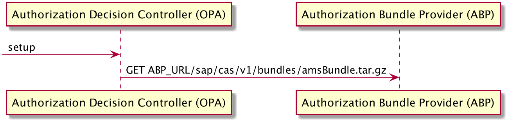

# Description
This sample is a Spring back-end application running on the Cloud Foundry. 
For all incoming requests it checks on the one hand whether the user is authenticated and on the other hand whether it is authorized using the **Cloud Authority Service (CAS)**.

CAS consists of several components, namely 
- the **Authorization Bundle Provider (ABP)**  
that stores and bundles application specific policy and data.
- the **Authorization Decision Controller (ADC)**  
that uses the [open source **Open Policy Agent (OPA)**](https://www.openpolicyagent.org/) to decide whether a given user has the policy to perform a dedicated action on a dedicated resource.


# Prerequisites

## Tools
- Java 8 JDK
```
$ java -version
openjdk version "1.8.0_222"
```
> make sure `JAVA_HOME` system environment variable is set ([HOWTO](https://www.baeldung.com/java-home-on-windows-7-8-10-mac-os-x-linux)).
- Maven
```
$ mvn --version
Maven home: /usr/local/Cellar/maven/3.6.2/libexec
Java version: 1.8.0_222, vendor: AdoptOpenJDK, runtime: /Library/Java/JavaVirtualMachines/adoptopenjdk-8.jdk/Contents/Home/jre
Default locale: en_US, platform encoding: UTF-8
OS name: "mac os x", version: "10.15.5", arch: "x86_64", family: "mac"
```
> make sure that it points to the correct Java JDK version.
- Docker-Compose / Docker as described [here](https://docs.docker.com/compose/install/)
```
$ docker-compose -version
docker-compose version 1.24.1, build 4667896b
```

- New Cloud Foundry Subaccount that fulfills these criteria:
  - Zone-enabled (!)
  - Provides `ams` service
  ```
  $ cf marketplace
  ...
  ams   standard    Authorization Management Service                               
  ...
  ```
  
## Clone repository and install CAS client libraries
You need to clone the repository that includes the sample and all its dependent libraries, that are not yet provided on Maven central:
```bash
git clone -b cas https://github.com/SAP/cloud-security-xsuaa-integration.git
cd cloud-security-xsuaa-integration
mvn clean install
```

## The Sample Project
The sample project is located in `samples/spring-security-cas`. It is a Spring-Boot application, which is build with Maven dependency plugin.

# Test Locally

## Access Authorization Decision Controller (ADC)
First, get familiar with the Authorization Decision Controller (ADC) service which uses the OPA policy engine.

1. Build your sample project (`samples/spring-security-cas) and start the Open Policy Agent (OPA) locally as part of a docker container:  
    ```
    mvn clean package
    docker-compose up -d
    ```  
   > With `mvn clean package` the `dcl-compiler-plugin` maven plugin generates based on the `src/main/resources/cas/*.dcl` files `*.rego` files that can be consumed by the OPA and puts them into the `target/classes/cas` folder. 
                                                                                                                                                                          
   > With `docker-compose` the docker container with OPA is preconfigured with all generated `*.rego` files. And the OPA service is accessible at OPA_URL = http://localhost:8181/v1/policies.

2. Perform some requests (using [`Postman` REST client](https://www.postman.com/))

    * `<OPA_URL>/v1/data` returns the users and their policies  
    * `<OPA_URL>/v1/policies` lists the divers policies
    * `<OPA_URL>/v1/data/rbac/allow` POST request with Content-Type: `application/json` and payload:
    ```
    {
        "input": {
            "$cas": {
                "userId": "Alice_countryCode@test.com",
                "action": "read"
            },
            "$app": {
                "CountryCode": "IT"
            }
        }
    }
    ```
    ... should return `true`, whereas a similar payload for the same `user` but different `action`:
    ```
    {
        "input": {
            "$cas": {  
                "userId": "Alice_countryCode@test.com",
                "action": "read"
            },
            "$app": {
                "CountryCode": "DE"
            }
        }
    }
    ```
    ... should return `false`, as the user has no policy assigned with `CountryCode`="`DE`". 

3. Find the current API documentation of OPA [here](https://www.openpolicyagent.org/docs/latest/rest-api/).

## Create the OAuth2 identity service instance
Use the xsuaa service broker and create a service instance
```shell
cf create-service xsuaa application spring-security-cas-authn -c '{ "xsappname": "spring-security-cas", "tenant-mode": "dedicated" }'
```
NOT YET SUPPORTED: Alternatively you can also create an IAS service instance (update the redirect uri to your "LANDSCAPE_APPS_DOMAIN")
```shell
cf create-service identity-beta default spring-security-cas-authn -c '{"oauth2-configuration":{"redirect-uris": ["https://*.cfapps.sap.hana.ondemand.com/login/oauth2/code/myoauthserver", "http://localhost:8080/login/oauth2/code/myoauthserver", "http://localhost:8080/login"]}}'
```

## Create the AMS service instance
NOT YET SUPPORTED (on Cloud Foundry marketplace), don't forget to replace `<<ID>>` with your d/c/i-User.
```
cf create-service ams standard spring-security-cas-ams-<<ID>>
```

## Configure the local environment
This demo application can be tested locally in a hybrid setup. That means that the application, as well as ADC runs locally but for the SSO setup it uses the OAuth2 Identity Service that was created on Cloud Foundry in the previous step. Perform these steps to adapt your configuration.

1. Get the `clientid`, the `clientsecret` and the `url` from your Identity Service as follows
    ```shell
    cf create-service-key spring-security-cas-authn spring-security-cas-sk
    cf service-key spring-security-cas-authn spring-security-cas-sk
    ```

1. Open the `/src/main/resources/application.yml` file and configure the `issuer_uri` with the `url`. In case of xsuaa service instance, you have to enhance the url by `/oauth/token`. Save the file changes.
1. Open the `localEnvironmentSetup.sh` file and update the values for `clientid` and `clientsecret` accordingly. Save the file changes.

> Note: The url of the Authorization Decision Controller (`OPA_URL`) is configured as system environment variable or as part of [application.yml](src/main/resources/application.yml) in case of Spring applications. 
In this sample, if `OPA_URL` is not configured `http://localhost:8181` is taken as default, which points to the [opa docker container](docker-compose.yaml).

## Start application locally
```
docker-compose up -d
source localEnvironmentSetup.sh
mvn spring-boot:run
```

## Test locally
When your application is successfully started (pls check the console logs) you can perform the following GET-requests with your browser:

- `http://localhost:8080/health` should return "ok" (Status Code `200`). If not please check the application logs using `cf logs spring-security-cas --recent`, whether the OPA (ADC) Service is unavailable.
- `http://localhost:8080/salesOrders/readByCountry/IT`  
This GET request executes a method secured with Spring Global Method Security. It will respond with error status code `403` (`unauthorized`) in case you do not have any policy assigned, that grants access for action `read` on any resources in `Country` = `<your country Code, e.g. 'IT'>`.

## Assign Permission
Check the application logs on your console to find out the user id and the zone id and the result of the authorization check. 
```
Is user <your user-id> (zoneId <your user-id>) authorized to perform action 'read' on resource 'null' and attributes '[Country=IT]' ? true
```

In case you have a lack of permissions you need to make sure that you (from `<zone-id>`, `<user-id>`) have the same policy in `src/main/resources/amsBundle/data.json` assigned like the user with id `Alice_countryCode`. 


Afterwards you need to rebuild and restart the docker-container:
```
mvn clean package
docker restart spring-security-cas_opa_1
```
Now repeat the forbidden test request.

Alternatively you can also debug the [TestControllerTest](src/test/java/sample.spring.adc/TestControllerTest.java) JUnit Test. 

# Deployment on Cloud Foundry

On Cloud Foundry the ADC Service gets deployed together with your application (as a sidecar). In the manifest you may need to adapt the route to your Authorization Bundle Provider (ABP). This serves on the one side the rules and policies as part of the `.rego` files and on the other side the data which contains the assignments of users to policies. During start-up the ADC service fetches the bundle from the ABP service.



## Configure the manifest
The [vars](../vars.yml) contains hosts and paths that need to be adopted. Use your d/c/i-User as ID and use `cfapps.sap.hana.ondemand.com` as `LANDSCAPE_APPS_DOMAIN`.

## Compile and deploy the application
Deploy the application using `cf push`. It will expect 800MB of free memory quota.

```shell
mvn clean package
cf push --vars-file ../vars.yml
```

## Access the application
After successful deployment, when accessing your application endpoints on Cloud Foundry, you get redirected to a login-screen to authenticate yourself.

- `https://spring-security-cas-usage-<<ID>>.<<LANDSCAPE_APPS_DOMAIN>>/health` should return "ok" (Status Code `200`). If not please check the application logs using `cf logs spring-security-cas --recent`, whether the OPA (ADC) Service is unavailable.
- `https://spring-security-cas-usage-<<ID>>.<<LANDSCAPE_APPS_DOMAIN>>/salesOrders/readByCountry/{country}`  
This GET request executes a method secured with Spring Global Method Security. It will respond with error status code `403` (`unauthorized`) in case you do not have any Policies assigned, that grants access for action `read` on any resources in `Country` = `<your country Code, e.g. 'IT'>`.


## Clean-Up
Finally delete your application and your service instances using the following commands:
```
docker rm --force spring-security-cas_opa_1
cf delete-service-key spring-security-cas-authn spring-security-cas-sk
cf delete spring-security-cas
cf delete-service spring-security-cas-authn
cf delete-service spring-security-cas-ams
```
