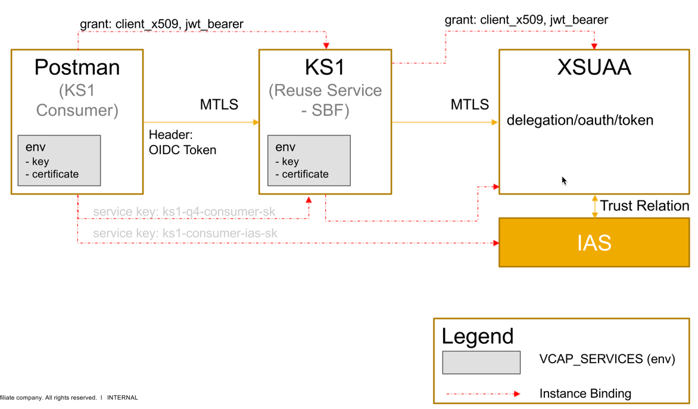

# Description
This sample demonstrates how to develop a Kernel Service as a spring-boot application, which is basically a Service Broker, and how it can be consumed. As of version `TODO` the `token-client` client library
- supports mutual TLS for Apache Rest clients
- exchanges IAS Open ID tokens (OIDC) with JWT bearer assertions using the `/delegation/oauth/token` endpoint of the XSUAA Authorization Server. This validates the consumer via X.509 client certificate and issues a JWT bearer assertion including the users authorizations.



# Deployment on Cloud Foundry

## Kernel Service (KS1)
We are going to deploy the Kernel Service as service broker.
Therefore the following steps are required.

#### Create Audit Log Service
As a prerequisite, an Audit log service instance have to be created and bound to the broker application

```bash
cf create-service auditlog standard broker-audit
```

#### Create UAA Service Instance of plan 'broker'
Use the [xs-security.json](./xs-security.json) to define the authentication settings and create a service instance
```bash
cf create-service xsuaa broker ks1-broker-uaa -c xs-security.json
```

> Note that your subaccount needs to be activated for certificates! 

#### Compile the Kernel Service (Spring Application)
Run maven to package the application
```bash
mvn clean package
```

#### Configuration the manifest.yml
The [vars](../vars.yml) contains hosts and paths that need to be adopted.

#### Deploy the Kernel Service
Deploy the application using cf push. It will expect 1 GB of free memory quota.

```shell
cf push --vars-file ../vars.yml
```

#### Register the Kernel Service in Cloud Foundry 
This command registers the kernel service new service broker with space scope at the provided URL.
```bash
cf create-service-broker ks1-q4-broker ks-user 123456 https://ks1-broker-q4-<ID>.<LANDSCAPE_APPS_DOMAIN> --space-scoped
```

Now `cf m` will list you also your `ks1-q4-<ID>` and we can create an instance of it in the next step.

> `123456` is the password, that matches the user/password information in `SBF_BROKER_CREDENTIALS_HASH` as part of the `manifest.yml.


## Create KS1 Consumer Application
The Kernel Service consumer is bound to IAS Identity Service and as well to the Kernel Service ks1. This binding is simulated by using service keys.


#### Create Kernel Service Instance and Key
Use the [parameters.json](./parameters.json) that specifies the instance parameters for the service instance creation:

```bash
cf create-service ks1-q4-<ID> default ks1-q4-consumer -c parameters.json
```
and its key:
```bash
cf create-service-key ks1-q4-consumer ks1-q4-consumer-sk
```

> You can have a look at the key with `cf service-key ks1-q4-consumer ks1-q4-consumer-sk`. This includes the so called consumer certificate which is needed for the mutualTLS connection to the Kernel Service.

#### Create IAS Service Instance and Key
```bash
cf create-service iasb default ks1-consumer-ias -c '{"redirect_uris": ["https://ks1-q4-<ID>.<LANDSCAPE_APPS_DOMAIN>/uaa/login/callback/my-oidc"]}'
```
and its key:
```bash
cf create-service-key ks1-consumer-ias ks1-consumer-ias-sk
```


## Access the Kernel Service with Consumer Certificate
After deployment, the kernel service can be called with X.509 certificate. Therefore we must generate a certificate.pem and a key.pem file from the service key information as described next.

#### Create certificate.pem and key.pem files for Kernel Service instance

**TODO** jq script???

#### Fetch ID Token as Consumer from IAS
```bash
curl -X POST \
  https://xs2security.accounts400.ondemand.com/oauth2/token 
  -H 'Authorization: Basic <ias-client-credentials>' 
  -H 'Content-Type: application/x-www-form-urlencoded' 
  -d 'response_type=id_token&grant_type=password&username=<ias-user>&password=<ias-user-pwd>'
```

#### Call Kernel Service
Now you can call the Kernel Service with the certificate files.

```bash
curl  --cert certificate.pem --key key.pem  -XPOST https://ks1-q4-<ID>.<LANDSCAPE_APPS_DOMAIN>/hello-token
-H 'Authorization: Bearer <your ID Token>'
```

You will get a response like:
```
{
  "client id": "sb-spring-security-xsuaa-usage!t291",
  "family name": "Jones",
  "given name": "Bob",
  "subaccount id": "2f047cc0-4364-4d8b-ae70-b8bd38d15bf0",
  "logon name": "bob.jones@example.com",
  "email": "bob.jones@example.com",
  "grant type": "password",
  "authorities": "[openid, ks1-q4!t19435.Display]",
  "scopes": "[openid, ks1-q4!t19435.Display]"
}
```

## Assign Role Collection to User
**TOBEREMOVED:** Create shadow user: https://ks-demo.authentication.sap.hana.ondemand.com/ (select XSUAA Trust Idp) which redirects you to IAS account, where you need to login with your IAS credentials.

**TODO** API Business Hub / SCIM Group / User

# Clean-Up

Finally delete your application and your (broker) service instances using the following commands:
```
cf delete-service-broker ks1-q4-broker
# cf purge-service-offering ks1-q4-<ID>
cf delete-service broker-audit
cf delete-service ks1-broker-uaa
cf delete-service ks1-consumer-ias
cf delete-service ks1-q4-consumer
cf delete -f ks1-q4
cf delete -f ks1-broker-q4
```

