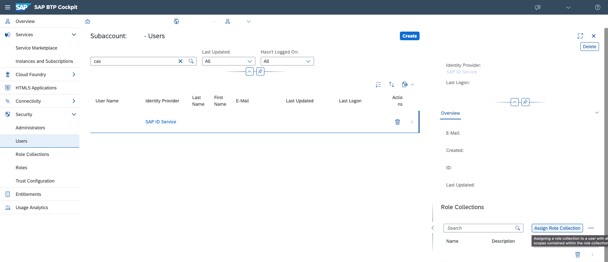

# Description
This is a java Springboot application using the `spring-webflux` as the web framework and protected by the `spring-security-oauth2-resource-server` and the `cloud-security-xsuaa-integration`.

# Deployment To Cloud Foundry
To deploy the application, the following steps are required:
- Configure the Application Router
- Compile the Java application
- Create an XSUAA service instance
- Configure the manifest.yml
- Deploy the application
- Assign Role to your user
- Access the application

## Configure the Application Router

The [Application Router](./approuter/package.json) is used to provide a single entry point to a business application that consists of several different apps (microservices). It dispatches requests to backend microservices and acts as a reverse proxy. The rules that determine which request should be forwarded to which _destinations_ are called _routes_. The application router can be configured to authenticate the users and propagate the user information. Finally, the application router can serve static content.

## Compile the Java Application
Run maven to package the application
```shell
mvn clean package
```

## Create the XSUAA Service Instance
Use the [xs-security.json](./xs-security.json) to define the authentication settings and create a service instance
```shell
cf create-service xsuaa application xsuaa-webflux -c xs-security.json
```

## Configure the manifest
The [vars](../vars.yml) contains hosts and paths that you might need to adopt.

## Deploy the application
Deploy the application using cf push. It will expect 1 GB of free memory quota.

```shell
cf push --vars-file ../vars.yml
```


## Cockpit administration tasks: Assign Role to your User
Finally, as part of your Identity Provider, e.g. SAP ID Service, assign the deployed Role Collection(s) such as `Webflux_API_Viewer` to your user as depicted in the screenshot below and as documented [here](https://help.sap.com/viewer/65de2977205c403bbc107264b8eccf4b/Cloud/en-US/9e1bf57130ef466e8017eab298b40e5e.html).



Further up-to-date information you can get on sap.help.com:
- [Maintain Role Collections](https://help.sap.com/viewer/65de2977205c403bbc107264b8eccf4b/Cloud/en-US/d5f1612d8230448bb6c02a7d9c8ac0d1.html)
- [Maintain Roles for Applications](https://help.sap.com/viewer/65de2977205c403bbc107264b8eccf4b/Cloud/en-US/7596a0bdab4649ac8a6f6721dc72db19.html).


## Access the application
After deployment, the AppRouter will trigger authentication automatically when you access one of the following URLs:

* `https://spring-webflux-security-xsuaa-usage-web-<ID>.<LANDSCAPE_APPS_DOMAIN>/v1/sayHello` - produces Http response with content-type `application/json; UTF-8` and the body containing the claims of the JWT or an error message

Direct access to the microservice (without the AppRouter) will return an error:

* `https://spring-webflux-security-xsuaa-usage-<ID>.<LANDSCAPE_APPS_DOMAIN>/v1/sayHello` - produces a error with `401` (unauthenticated) status code, as it calls the service without `Authorization` header.

## Clean-Up

Finally delete your application and your service instances using the following commands:
```
cf delete -f spring-webflux-security-xsuaa-usage
cf delete -f approuter-spring-webflux-security-xsuaa-usage
cf delete-service -f xsuaa-webflux
```