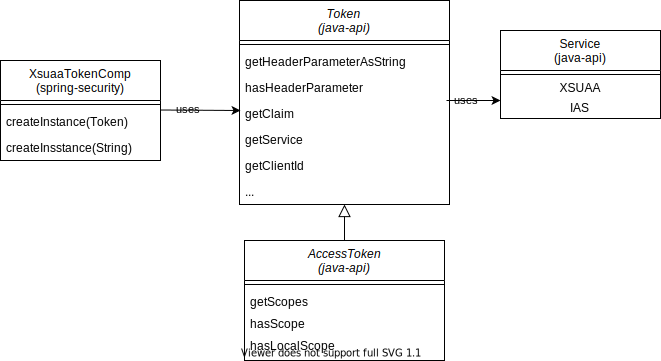

# Migration Guide for Applications that use spring-xsuaa Security Client Library

This migration guide is a step-by-step guide explaining how to replace the [`spring-xsuaa`](/spring-xsuaa) with this [`spring-security`](/spring-security) Security client library.

## Maven Dependencies
To use the new SAP CP [spring-security](/spring-security) client library the dependencies declared in maven `pom.xml` need to be updated.

Make sure, that you add the dependencies that are documented [here](/spring-security#maven-dependencies).

Now you are ready to **remove** the **`spring-xsuaa`** client library by deleting the following dependencies from the `pom.xml`:

groupId | artifactId
--- | --- 
com.sap.cloud.security.xsuaa | spring-xsuaa
com.sap.cloud.security.xsuaa | xsuaa-spring-boot-starter


## Configuration changes
After the dependencies have been changed, the spring security configuration needs some adjustments as well.

In case you have configured your `TokenAuthenticationConverter` with `setLocalScopeAsAuthorities(true)` then you can use the auto-configured converter as documented [here](/spring-security#setup-spring-security-oauth-20-resource-server), which initializes the `XsuaaTokenAuthorizationConverter`.

**Before**
```java
@Configuration
@EnableWebSecurity
public class SecurityConfiguration {

  Converter<Jwt, AbstractAuthenticationToken> customJwtAuthenticationConverter() {
    TokenAuthenticationConverter converter = new TokenAuthenticationConverter(xsuaaServiceConfiguration);
    converter.setLocalScopeAsAuthorities(true);
    return converter;
  }
  ...
}
```

**After**
```java
@Configuration
@EnableWebSecurity
@PropertySource(factory = IdentityServicesPropertySourceFactory.class, ignoreResourceNotFound = true, value = { "" }) // might be auto-configured in a future release
public class SecurityConfiguration {

  @Autowired
  Converter<Jwt, AbstractAuthenticationToken> authConverter;
  
  ...
}
```

## Access VCAP_SERVICES values
```spring-security``` automatically maps the `VCAP_SERVICES` credentials to Spring properties. Please note that the **prefix has changed** from ```xsuaa.*``` to ```sap.security.services.xsuaa``` or ```sap.security.services.xsuaa[0]``` in case of multiple xsuaa service bindings. Please find a sample property file [here](/samples/spring-security-hybrid-usage/src/test/resources/application-multixsuaa.yml).  

#### ``@Value``
  **Before**  
  ```java
  @Value("${xsuaa.clientid})
  ```  

  **After**  
  ```java
  @Value("${sap.security.services.xsuaa.clientid}) // new prefix
  ```  

#### Bean ``XsuaaServiceConfiguration``
  **Before**  
  ```java
  import com.sap.cloud.security.xsuaa.XsuaaServiceConfiguration;
  ...
  
  @Autowired
  XsuaaServiceConfiguration xsuaaServiceConfiguration;
  ```  

  **After**  
  ```java
  import com.sap.cloud.security.spring.config.XsuaaServiceConfiguration; // new import
  ...
  
  @Autowired
  XsuaaServiceConfiguration xsuaaServiceConfiguration;
  ```  

#### Bean ``XsuaaServiceConfigurations`` (multiple xsuaa bindings)
  **Before**  

  ```java
  import com.sap.cloud.security.xsuaa.XsuaaCredentials;
  import com.sap.cloud.security.xsuaa.XsuaaServiceConfigurationCustom;
   
  ...
   
  @Bean
  @ConfigurationProperties("vcap.services.<<name of your xsuaa instance of plan application>>.credentials")
  public XsuaaCredentials xsuaaCredentials() {
     return new XsuaaCredentials(); // primary Xsuaa service binding, e.g. application
  }

  @Bean
  @ConfigurationProperties("vcap.services.<<name of your xsuaa instance of plan broker>>.credentials")
  public XsuaaCredentials brokerCredentials() {
     return new XsuaaCredentials(); // secondary Xsuaa service binding, e.g. broker
  }
  @Bean
  public XsuaaServiceConfiguration customXsuaaConfig() {
     return new XsuaaServiceConfigurationCustom(xsuaaCredentials());
  }
  ```
    
  **After**  
  ```java
  import com.sap.cloud.security.spring.config.XsuaaServiceConfigurations; // new import
  ...
  
  @Autowired
  XsuaaServiceConfigurations xsuaaServiceConfigurations;
  ```  

  > :bulb: application plan is served as *main* configuration, you can get it using ``xsuaaServiceConfigurations.get(0)``.   
  > Other configurations, e.g. of plan broker, can be accessed with index > 0.


## Fetch data from token

#### ``SpringSecurityContext``
You may have code parts that use the `SpringSecurityContext` to get the token. Just update the import from:
````java
import com.sap.cloud.security.xsuaa.token.SpringSecurityContext;
````
to
````java
import com.sap.cloud.security.spring.token.SpringSecurityContext; // new import
````

#### `Token` methods
You may have code parts that use the `Token` interface to access details from the token. You need to update the import from:
````java
import com.sap.cloud.security.xsuaa.token.Token;
````
to
````java
import com.sap.cloud.security.token.Token; // new import - preferred
// or
import com.sap.cloud.security.token.XsuaaTokenComp; // new import
`````

The ``Token`` interface from ``java-api`` provides methods that serves access to details of a token, independent whether it is issued by xsuaa or by identity service. That's why the new ``Token`` interface isn't compatible to the ``Token`` interface from ``spring-xsuaa`` client library.<br>
``java-api`` provides also the ```AccessToken``` sub-interface to access xsuaa specific claims, in case of access tokens issued by the xsuaa service.



**Alternatively - for compatibility, ``XsuaaTokenComp`` class can be used to decorate the `AccessToken` interface, which implements almost all methods of ` com.sap.cloud.security.xsuaa.token.Token` (spring-xsuaa) interface**. <br>

It is provided in an extra module. This maven dependency needs to be provided additionally:
```xml
<dependency>
    <groupId>com.sap.cloud.security.xsuaa</groupId>
    <artifactId>spring-security-compatibility</artifactId>
    <version>3.3.0</version>
</dependency>
```

```java
Token xsuaaToken = XsuaaTokenComp.createInstance(SpringSecurityContext.getAccessToken());
xsuaaToken.getCloneServiceInstanceId();
```

> :bulb: `createInstance` raises an `IllegalArgumentException` runtime exception if the token isn't issued by xsuaa service. 
> :bulb: `getAuthorities`, as well as the `org.springframework.security.core.userdetails.UserDetails` is not implemented by `XsuaaTokenComp`.

The table below gives an overview of the methods that are not directly available in the new ```Token``` interface, but can be accessed via the ``XsuaaTokenComp`` decorator class.

<br>
 
| `com.sap.cloud.security.xsuaa.token.Token` methods  | Xsuaa only? | Workaround in `spring.security` (`com.sap.cloud.security.token.Token`) |
|-------------------------|---|-----------------------------------------------------------------------------------------------|
| `getSubaccountId`       | X | Available via `AccessToken` interface.     
| `getSubdomain`          | X | `getAttributeFromClaimAsString(EXTERNAL_ATTRIBUTE, EXTERNAL_ATTRIBUTE_ZDN)`
| `getGrantType`          | X | `getGrantType().toString()`.
| `getLogonName`          | (X) | ``getClaimAsString("user_name")``. :bulb: the name differs between the two services.
| `getOrigin`             | X | ``getClaimAsString(TokenClaims.XSUAA.ORIGIN)``.
| `getGivenName`          |   | ``getClaimAsString(TokenClaims.GIVEN_NAME)``. :bulb: no support for SAML 2.0 - XSUAA mapping.
| `getFamilyName`         |   | ``getClaimAsString(TokenClaims.FAMILY_NAME)``. :bulb: no support for SAML 2.0 - XSUAA mapping.
| `getEmail`              |   | ``getClaimAsString(TokenClaims.EMAIL)``. :bulb: no support for SAML 2.0 - XSUAA mapping.
| `getXSUserAttribute`    | X | ```getAttributeFromClaimAsStringList(TokenClaims.XSUAA.XS_USER_ATTRIBUTES, attributeName)```
| `getAdditionalAuthAttribute`  | X | ```getAttributeFromClaimAsString("az_attr", attributeName)```
| `getCloneServiceInstanceId`   | X | ```getAttributeFromClaimAsString(TokenClaims.XSUAA.EXTERNAL_ATTRIBUTE, "serviceinstanceid")```
| `getAppToken`           |   | `getTokenValue`
| `getScopes`             | X | `getClaimAsStringList(TokenClaims.XSUAA.SCOPES)`
| `getExpiration()`       |   | `getExpiration()` and for convenience `isExpired()`
| `getUsername()`         |   | `getPrincipal()`

> :bulb: In case the ```Xsuaa only?``` flag is set, the method returns "null" in case of Id token from identity service.  
> :bulb: In case of Id token from identity service, the ``Token`` can neither be casted to `AccessToken` nor to `XsuaaToken`.  A cast is possible in case of: ```Service.XSUAA.equals(token.getService())```.   

 
#### Spring's `Jwt` methods

The runtime type of `com.sap.cloud.security.xsuaa.token.Token` is `com.sap.cloud.security.xsuaa.token.XsuaaToken`, which provides additional methods that can be used to extract data from the token since it is a subclass of
`org.springframework.security.oauth2.jwt.Jwt`. 

The following table gives an overview about the most prominent used ``Jwt`` methods and how they can be mapped:

|`org.springframework.security.oauth2.jwt.Jwt` methods | Workaround in `spring.security` (using `com.sap.cloud.security.token.Token`) |
|-------------------------|--------------------------------------------------------------------------------------------------|
| `getClaimAsString`       | `getClaimAsString` |
| `getClaimAsStringList`  | ` getClaimAsStringList` |
| `containsClaim`          | `hasClaim` |
| `getClaims`              | `getClaims` |
| `getHeaders`             | `getHeaders` |
| `getClaimAsInstant`      | `getClaimAsJsonObject().getAsInstant()` |


## Testing
In your unit test you might want to generate jwt tokens and have them validated. The new
[java-security-test](/java-security-test) library provides its own `JwtGenerator`. 

See the [java-security-test documentation](/java-security-test) for more details, also on how to leverage JUnit 5 extensions.

The new security library requires the following key value pairs to configure the jwt validators. You can use the defaults specified within the ``java-security-test`` testing library.

````yaml
sap:
  security:
    services:
      xsuaa:
        xsappname: xsapp!t0815
        uaadomain: localhost
        clientid: sb-clientId!t0815
        clientsecret: pwd
        url: http://localhost

      identity:
        clientid: sb-clientId!t0815
        domain: localhost
        url: http://localhost
````

## Things to check after migration 
When your code compiles again you should first check that all your unit tests are running again. If you can test your
application locally make sure it is still working and finally test the application in cloud foundry.


## Issues
In case you face issues with the migration steps check this [troubleshoot guide](/spring-security/README.md#troubleshoot) for known issues and file a new github issue in case youe problem is not yet described in the section. With that you can help us to improve this migration guide!

## Samples
- [Sample](/samples/spring-security-hybrid-usage)    

## Further References
- [spring-security documentation](/spring-security/README.md)
